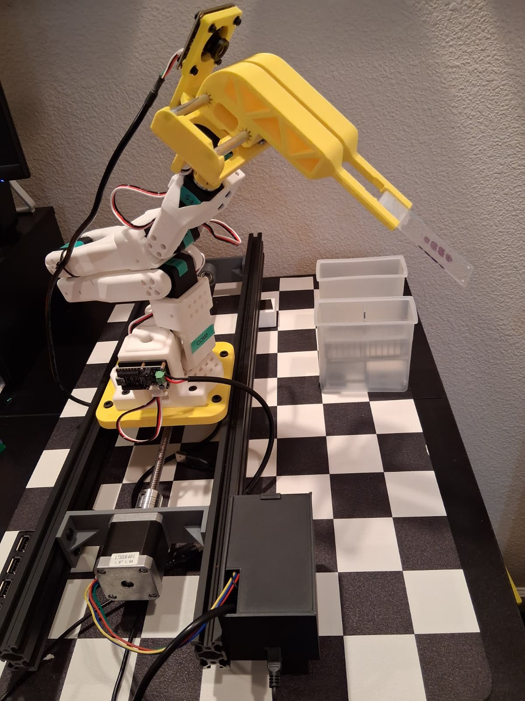
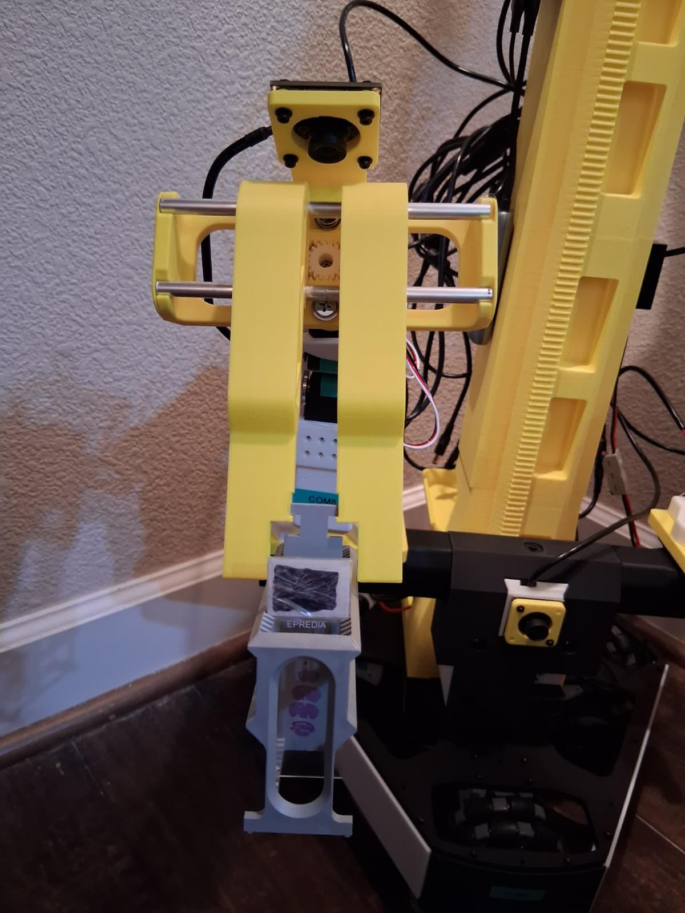
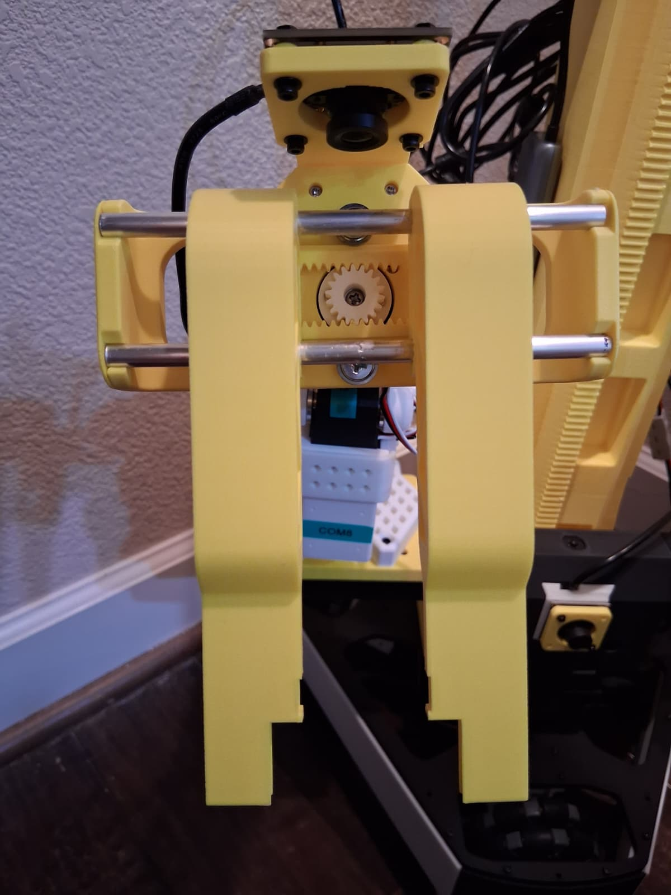
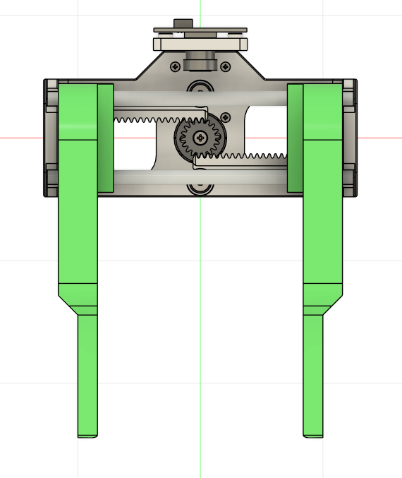
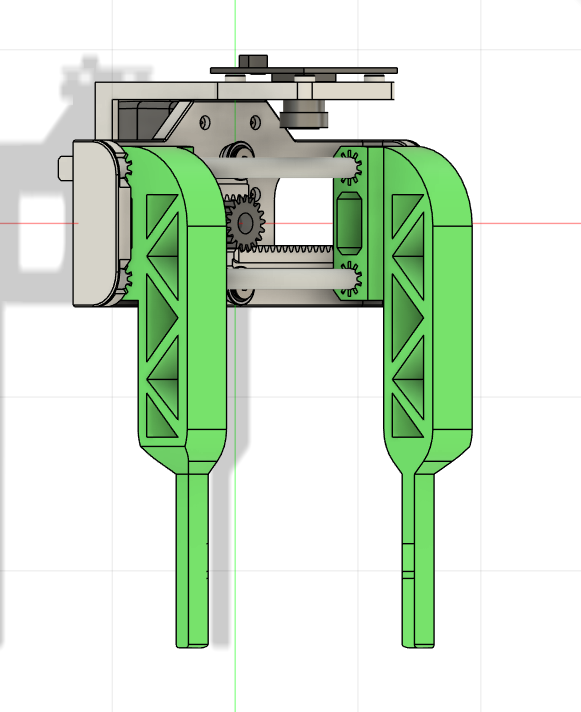
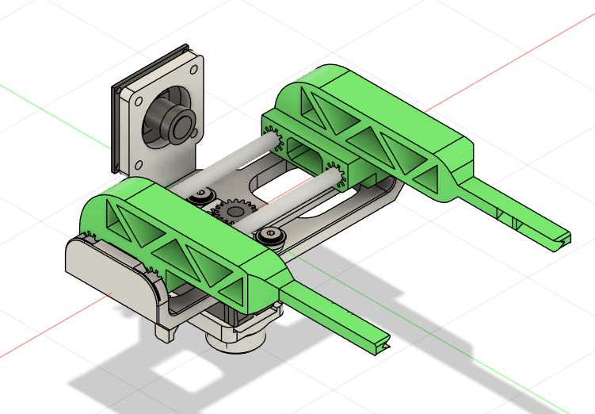

# Histology Slide Gripper (Community Mod)

A community variant of the SO-ARM100/101 Parallel Gripper by [Michael Viacheslavov](https://github.com/histochemichael), adapted for histology and histotechnology automation: gentle pickup of standard 75 x 25 mm microscope slides, slide staining dippers/racks, and a close camera view of the grasp.

*SO-ARM100/101 parallel gripper using the custom clamps to handle microscope slides and a staining dipper/rack.*

## What Changed vs. the Base Gripper

| Addition | Description |
|----------|-------------|
| Microscope slide clamps | Long, flat clamp geometry supports direct pickup of standard 75 x 25 mm microscope slides. |
| Slide rack/dipper handling | Clamp spacing and tips engage slide staining dippers/racks like the Medicus Health slide staining dipper linked below. |
| Angled Arducam holder | A printable holder aims an Arducam global-shutter USB camera at the gripper jaws for close-up monitoring of slide and rack pickup. |
| Complete assembly CAD | A full printable STL and editable STEP assembly are in [`cad/`](cad/). |

## Gallery

| Single slide pickup | Staining dipper/rack pickup | Arducam holder view |
|:-:|:-:|:-:|
|  |  |  |

| Front view | Jaw geometry | Isometric assembly |
|:-:|:-:|:-:|
|  |  |  |

## CAD Files

| File | Format | Use |
|------|--------|-----|
| [`cad/the-parallel-microscope-slide-gripper.stl`](cad/the-parallel-microscope-slide-gripper.stl) | STL | Printable full assembly for the microscope slide gripper mod. |
| [`cad/the-parallel-microscope-slide-gripper.step`](cad/the-parallel-microscope-slide-gripper.step) | STEP | Editable CAD source for the full assembly. |

## Add-on Bill of Materials

These items are specific to the slide/rack workflow and are not part of the base gripper [BOM](../../docs/bom.md).

| Component | Qty | Notes | Link |
|-----------|:---:|-------|------|
| Arducam 100fps Mono Global Shutter USB Camera, OV9281 | 1 | Camera used with the angled holder to watch slide and rack pickup near the jaws. | [Amazon UK](https://www.amazon.co.uk/Arducam-Shutter-Distortion-Computer-Raspberry/dp/B0FXWWF55X) |
| Slide Staining Plastic Dipper with Handle | 1+ | Reference staining dipper/rack target; designed for standard 75 x 25 mm slides. | [Medicus Health](https://www.medicus-health.com/slide-staining-dipper.html) |
| Parallel microscope slide gripper assembly | 1 | Print `the-parallel-microscope-slide-gripper.stl`; STEP file is included for edits. | [`cad/`](cad/) |

## Notes

- The gripper fingers are intended for standard 75 x 25 mm microscope slides and slide staining dippers/racks.
- The assembly keeps the camera view aimed toward the gripper jaws so the camera can observe slide and rack pickup.
- Test with non-critical slides first and tune print material, infill, and gripper force for your workflow.

## Links

- 🎥 [Demo: slide and staining rack pickup (LinkedIn)](https://www.linkedin.com/posts/michael-viacheslavov_histology-histotechnology-robotics-ugcPost-7482570199859240960-Gqpw/)
