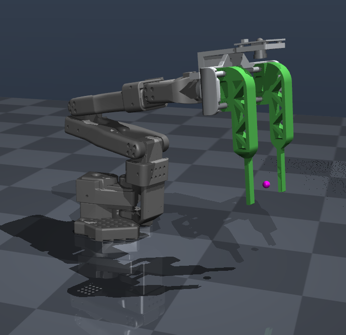

# Microscope Slide Gripper in MuJoCo

The SO-ARM101 with the histology slide parallel gripper, exported from Fusion and mounted in place of the stock Robo9 clamps.

Tested with `mujoco` 3.4.0 in the `lerobot` conda environment. No ROS 2 or Docker is required.

```bash
conda activate lerobot
cd community/histology-slide-gripper/mujoco
python -m pip install -r requirements.txt
python view.py                      # full arm + slide gripper
python view.py scene_gripper.xml    # gripper alone on a testbench
python test_grasp.py                # headless grasp-and-lift check -> grasp_check.png
```

## MuJoCo simulation preview



This scene shows the SO-ARM101 with the histology slide parallel gripper mounted on
the wrist, using the same MuJoCo model launched by:

```bash
conda activate lerobot
cd community/histology-slide-gripper/mujoco
python view.py
```

## What is modelled

| Link | Source | Mass |
|---|---|---|
| `slide_gripper_base` | main frame, STS3215, guide rods, bearings, camera holder, Arducam OV9281 | 0.20 kg |
| `sg_jaw_right` / `sg_jaw_left` | RB9.01.062.020 clamp + RB9.01.062.030 rack (m0.8) | 0.035 kg each |
| `sg_pinion` | RB9.01.062.040 involute gear, 18 T, 0.8 module | 0.008 kg |

Kinematics taken from the as-built joints in the Fusion assembly
(`Slide_Jaw_Right`, `Slide_Jaw_Left`, `Drive_Pinion`), which are self-consistent:
the 18 T / 0.8 module pinion has a 7.2 mm pitch radius, and 7.2 mm x 4.9306 rad =
**35.5 mm** of rack travel per jaw — exactly the slider limits in the CAD.

## Control

One actuator, `sg_grip`, commanded in **metres of jaw travel**:

| `ctrl` | jaw travel | aperture between the blade faces |
|---|---|---|
| `0.0` | 0 mm | **84 mm** (fully open) |
| `0.0295` | 29.5 mm | 25 mm (a microscope slide) |
| `0.0355` | 35.5 mm | **13 mm** (fully closed) |

Both jaws are driven from the single pinion, so `sg_jaw_left_joint` and
`sg_pinion_joint` are slaved to `sg_jaw_right_joint` by `<equality>` constraints —
the gear visibly turns with the jaws. Command *past* the object to get squeeze:
closing onto a 25 mm object with `ctrl=0.0355` gives about 4.7 N at the pads.

The five arm joints keep their URDF names (`base_link_to_link1` ... `link4_to_link5`).

## Collision geometry

Mesh geoms are **visual only** (`contype=0`), because MuJoCo convex-hulls meshes and
the hull of an L-shaped jaw fills the gap you are trying to grip with. Contact is
carried by boxes on the two gripping surfaces of each jaw (group 3, hidden in the
renders):

- `sg_pad_*` — the 30 mm slide blade, CAD x 42–50, z 26–31
- `sg_mid_*` — the wider mid-section, CAD x 42–58, z 18.5–38.5

The TCP site `sg_tcp` sits between the blades; `sg_camera` is the Arducam optical frame.

## Files

- `so101_slide_gripper.xml` — the full robot (generated by `build_full.py`)
- `scene_gripper.xml` — gripper alone, with a lift axis for testing
- `gripper_assets.xml` / `gripper_body.xml` / `gripper_actuation.xml` — the gripper,
  as includes usable from both degree- and radian-unit models
- `meshes/{base,jaw_right,jaw_left,pinion}.stl` — exported from Fusion in **assembly
  coordinates**, so every part is already in its correct place (no per-part origins to chase)
- `meshes/arm/` — arm meshes from the Robo9 repo
- `build_arm.py` — strips xacro from `so_101.urdf.xacro`, drops the stock clamps, compiles to MJCF
- `build_full.py` — grafts the gripper onto `link5`; **edit `MOUNT_POS`/`MOUNT_QUAT` here**

## How the gripper was located on the wrist

`link5_1.stl` in the Robo9 repo is not just the wrist — it contains the entire stock
gripper (frame, guide rods, camera). So it is the part the slide-gripper design replaces, and
`build_full.py` deletes its mesh and drops its mass from 0.556 kg to 0.08 kg.

The mount pose was solved, not guessed: `base.stl` was fitted against
`link5_1.stl` over the geometry they share (main frame + guide rods) by searching all
24 axis-aligned rotations and scoring nearest-neighbour distance. Best fit is
**+90 deg about X** (CAD +Y -> link5 +Z, CAD +Z -> link5 -Y) with a 2.0 mm median
residual — the slide clamps hang perpendicular to Robo9's pointed clamps, matching
your Fusion assembly.

## Stability

The model settles to `max|qvel| = 0` and stays there. If you ever see it shake, the
first thing to check is stray contacts (`ncon` in the viewer's info panel should be 0
with the arm at rest). Three things were needed:

1. **`<exclude body1="world" body2="link1_1"/>`** � the real fix. The URDF importer
   merges `base_link` into `worldbody`, and MuJoCo skips parent/child collisions
   *except* when the parent is the world body. So the base mesh and link1 mesh
   interpenetrated at the shoulder, producing a permanent contact that pinned the yaw
   actuator at its +-1.5 N.m limit. This alone took settled `|qvel|` from 4.78 to 0.
2. `sg_pinion_joint` armature 1e-6 -> **1e-4**. A joint slaved by a stiff equality with
   almost no inertia chatters (it was peaking at 12 rad/s).
3. Equality `solref` 0.002 -> **0.01**. A constraint time constant equal to the timestep
   is too stiff to solve cleanly; this also made the pinion land exactly on -282.5 deg
   instead of -280 deg.

## Caveats

- **Masses are assumed, not measured.** Fusion reports every body as steel (the jaws
  come out at 221 g each); the values above are PLA-and-hardware estimates. If you
  assign real materials in Fusion, update the `mass=` attributes in `gripper_body.xml`.
- Inertia is derived by MuJoCo from the mesh shape plus that mass, not from Fusion's tensor.
- The arm's joint limits, damping and friction are inherited from the repo's URDF and
  have not been re-tuned.
- **The arm's link masses are steel-density too**, the same defect as the gripper: the
  repo URDF totals **2.81 kg** against roughly 1 kg for a real SO-101, and `link2_to_link3`
  needs 1.91 N.m to hold itself up against a 1.5 N.m actuator limit, so it sags. This does
  not cause shaking (see above) but it does make the arm behave like a much heavier
  machine. Scaling every arm link mass and `diaginertia` by ~0.36 brings the total to
  1.19 kg and clears the saturation; the real STS3215 also stalls nearer 2.9 N.m than the
  URDF's conservative 1.5.
- The 2 mm alignment residual is real: the "Main frame_125 follower" is not identical
  to the frame baked into `link5_1.stl`.
- `sg_pinion_joint` is cosmetic � it carries no load, because the two racks are coupled
  to each other directly. It exists so the gear turns the right way on screen.

## Driving it in the MuJoCo viewer

Use the **`sg_grip` slider in the Control panel**. The sliders in the *Joint* panel
write `qpos` directly and bypass the equality constraints, so dragging those (especially
while paused) desynchronises the jaws from the pinion. Pressing Run re-converges it.

## Re-exporting after a CAD change

The export ran through the Fusion MCP connection: it walks every occurrence, groups
bodies into the four rigid links, and writes binary STLs in assembly coordinates
(mm). Re-export with the Fusion design open to refresh the meshes in
place — nothing else needs to change unless you move a joint.
