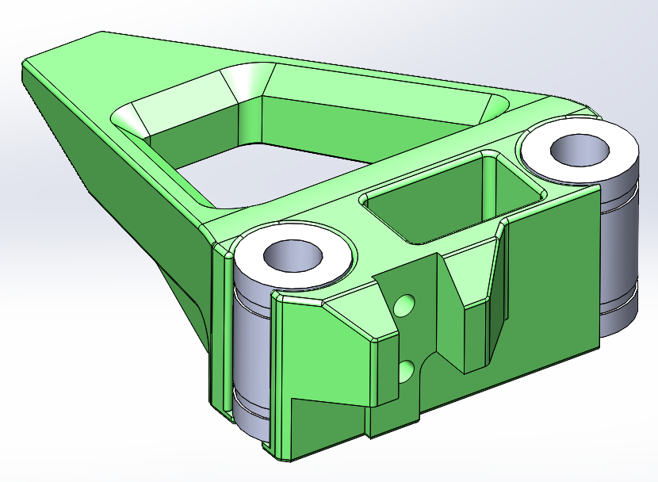
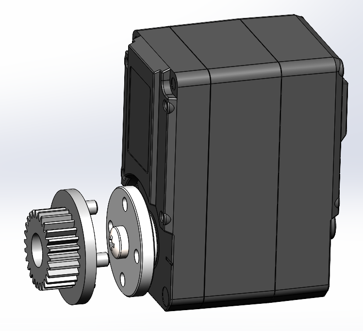
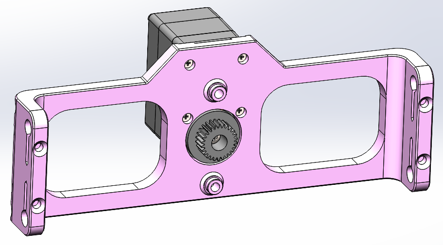
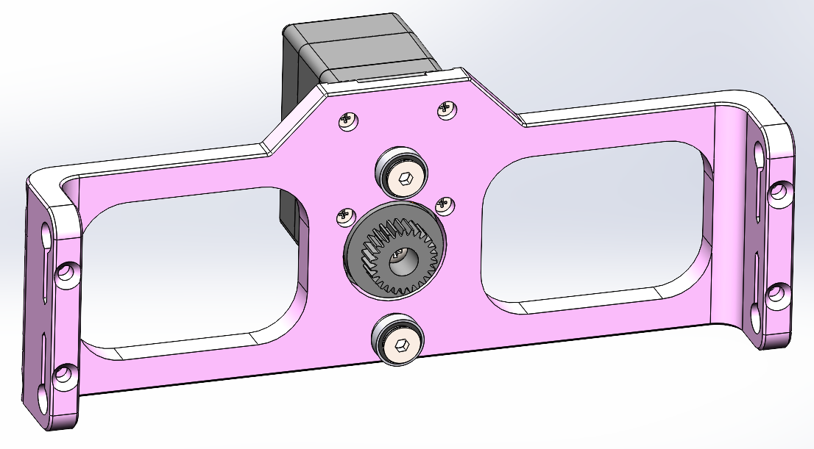
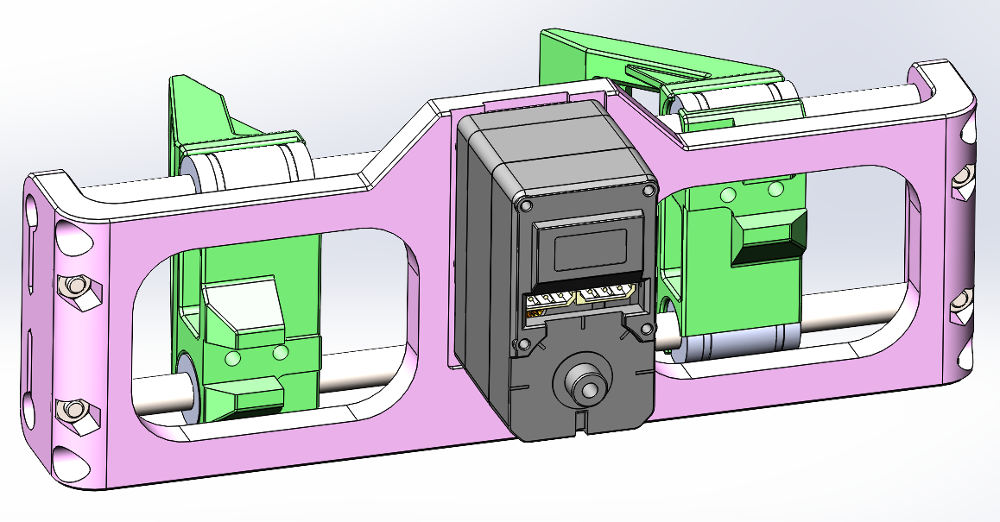
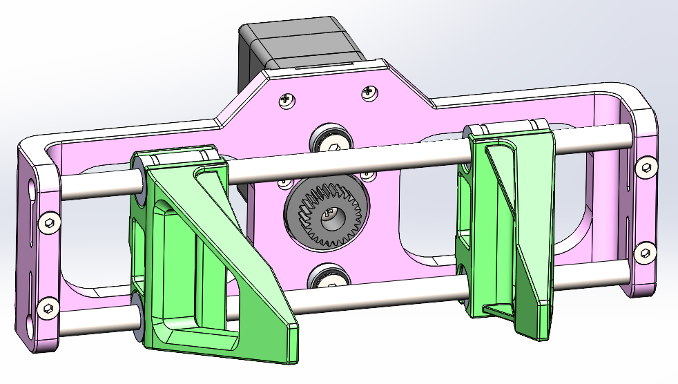
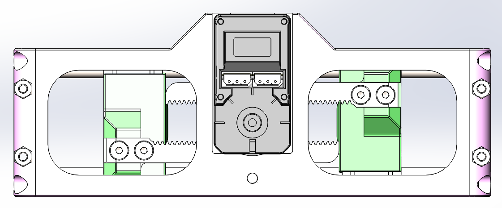
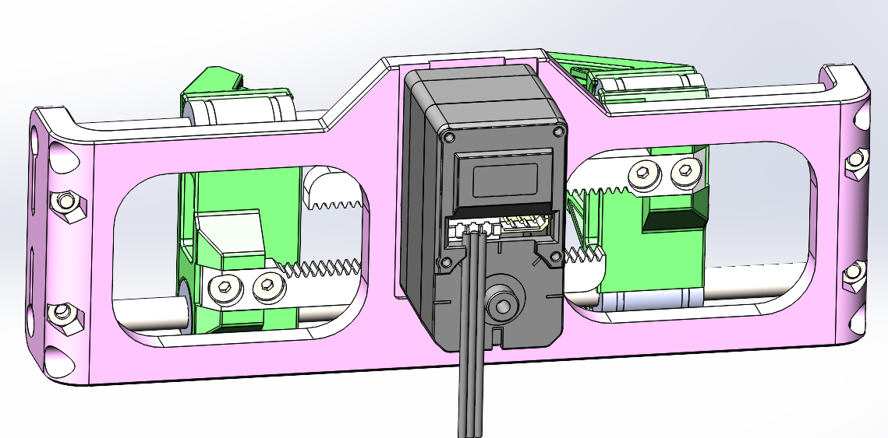
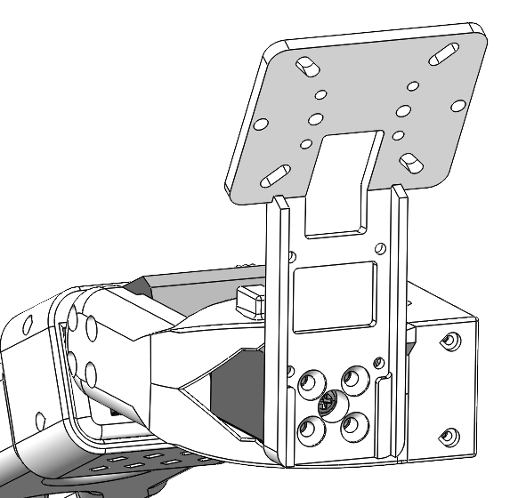

# Assembly Guide for Follower Gripper SO-ARM101

This guide provides step-by-step instructions for assembling the parallel gripper. Follow these steps carefully to ensure proper operation.

## Required Tools

- Phillips head screwdriver
- Hex keys M3 and M4

---

## Step 1: Install Linear Bearings in Clamps

**Components needed:**
- 2x Clamps (RB9.01.060.021)
- 4x LM6UU Linear Bearings (6x12x19 mm)

**Instructions:**
1. Take the first clamp part
2. Carefully press 2x LM6UU bearings into the designated bearing seats. If bearings fit in too easily, wrap some tape around them
3. Ensure bearings are fully seated
4. Repeat for the second clamp

---

## Step 2: Install Gear on Servo

**Components needed:**
- 1x Feetech STS3250 Servo
- 1x Gear for Gripper (RB9.01.060.041)
- 1x Servo disk (from servo kit)
- 1x Servo mounting screw M3x6 (from servo kit)
- 4x Set Screw DIN 913 M3x4

**Instructions:**
1. Place Gear for Gripper on Servo disk and fix them together with 4x Set Screws M3x4. Pay attention that there is no gap between parts
2. Mount the gear assembly onto the servo output shaft
3. Secure with the screw M3x6 provided in the servo kit

---

## Step 3: Mount Servo on Main Frame

**Components needed:**
- 1x Main Frame (RB9.01.060.015)
- 1x Assembled servo with gear
- 4x Self-tapping screws (from servo kit)

**Instructions:**
1. Position the servo on the main frame and align mounting holes
2. Secure the servo using 4x self-tapping screws from the servo kit

---

## Step 4: Install Bearings on Main Frame

**Components needed:**
- 2x MR106ZZ Bearings (6x10x3 mm)
- 2x Self-tapping screws with a large head (from servo kit)

**Instructions:**
1. Insert the 2x MR106ZZ bearings into their designated positions on the main frame
2. Secure each bearing with self-tapping screw

---

## Step 5: Install Rods and Clamps

**Components needed:**
- 2x Stainless Steel Rods (6mm diameter, 125mm length)
- 2x Assembled clamps (with LM6UU bearings)
- 4x M3x20 DIN 7991 screws
- 4x M3 DIN 934 nuts

**Instructions:**
1. Insert the 2x steel rods through the one side of main frame
2. Slide the 2x clamps onto the rods
3. Press rods further through the second side of the main frame
4. Secure rods in the main frame using 4x M3x20 screws and 4x M3 nuts

---

## Step 6: Attach Gear Racks

**Components needed:**
- 2x Gear Racks (RB9.01.060.030)
- 4x M3x8 DIN 7991 screws

**Instructions:**
1. Position the gear racks on the back side of each clamp
2. **Important**: Ensure clamps are symmetrically positioned from the main frame center
3. The gear racks should engage properly with the drive gear
4. Secure each gear rack with 2x M3x8 screws

---

## Step 7: Insert Servo Cable

**Components needed:**
- Servo cable (from servo kit)

**Instructions:**
1. Insert cable so it will go straight down

---

## Step 8: Insert Screws for Rigidity

**Components needed:**
- 4x M3x50 DIN 912 screws

**Instructions:**
1. From each side of the Main Frame screw 2x screws M3x50

---

## Step 9: Gripper Holder Attachment

**Components needed:**
- 1x Camera holder (RB9.01.060.073) or Servo plate (RB9.01.060.080)
- 1x Parallel Gripper SO-ARM101
- 4x M3x6 Screws (from servo kit)
- 4x Self-tapping screws (from servo kit)

**Instructions:**
1. Depending on what type of Gripper you want to connect, attach Camera holder or Servo plate to the Wrist Joint horn and fix with 4x M3x6 screws
2. Attach the Parallel Gripper to the Camera holder or Servo plate and fix with 4x self-tapping screws
3. Connect cable from the Parallel Gripper to servo №5

---

## Assembly Complete!

Congratulations! Your SO-ARM101 is now assembled and ready for use.

### Next Steps
- Configure servo parameters using the Feetech software
- Test gripper operation before use
