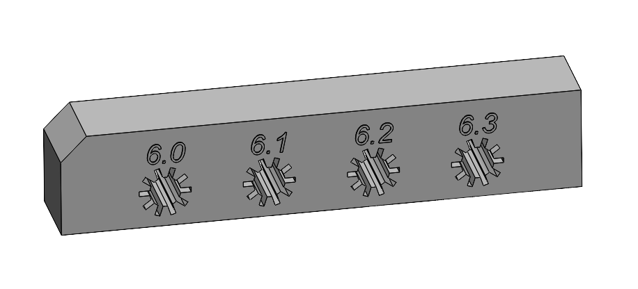

# Quick Start Guide

Get your Follower Gripper for SO-ARM101 up and running!

[](https://youtube.com/shorts/bSyXjgNGXZk)

*Click the image to [watch the gripper in action](https://youtube.com/shorts/bSyXjgNGXZk)!*

## What You'll Need

### Hardware
- [ ] All 3D printed parts (see [3D Models](../models/))
- [ ] Electronic components (see [BOM](bom.md))
- [ ] Mechanical components (bearings, rods, fasteners)
- [ ] Tools: Phillips screwdriver PH1, Hex keys M2 (H1.5) and M4 (H2.5)

### Software
- [ ] Python 3.6+ installed
- [ ] STServo SDK downloaded
- [ ] Serial communication interface

---

## Step 1: 3D Print the Parts (2-4 hours)

1. Download STL files from `models/parts/`
2. Print with recommended settings:
   - Layer height: 0.2mm
   - Infill: 20% (frame/clamps), 100% (gears)
   - Material: PLA or PETG
3. Remove supports



To ensure the rods you purchase fit better into the clamps, you need to use a test piece. Print it and, working from the largest hole to the smallest, select the diameter that allows the rod to fit into the test part without difficulty and with minimal clearance. Then print clamps with the same hole diameter which is mentioned in stl file name (e.g. RB9.01.062.021 (D6.1) if you choose diameter 6.1 mm).

**Compatible 3D Printers** (180×180mm+ bed):
- Bambu Lab A1 mini
- Prusa MINI / MINI+
- Anycubic Kobra Neo
- Any printer with bed ≥180×180mm

**Parts to print:**
- 1x Main frame (RB9.01.062.010)
- 2x Clamp (RB9.01.062.020)
- 2x Gear rack (RB9.01.062.030)
- 1x Gear (RB9.01.062.040)
- 1x Camera holder (RB9.01.060.074)
- 1x Holder (RB9.01.060.080)
- 1x Camera Spacer (RB9.01.060.090)

---

## Step 2: Gather Components (1-2 days shipping)

Order parts from the [Bill of Materials](bom.md):

| Component | Qty | Est. Cost |
|-----------|:---:|-----------|
| Feetech STS3215 servo | 1 | ~$29 |
| Bus Servo Adapter Board | 1 | ~$11 |
| MF106ZZ bearings (10x6x3mm) | 2 | ~$2 |
| Aluminium/carbon tubes D6x1x125mm | 2 | ~$4 |
| 3d printing PLA| 8 parts | ~$12 |
| Fasteners (M2/M4 screws/nuts) | various | ~$3 |

**Total estimated cost: ~$62**

---

## Step 3: Assembly (30-45 minutes)

Follow the detailed [Assembly Guide](assembly-guide.md):


1. Insert servo cable
2. Using Feetech software move servo to its minimal position (move the slider in the software to the left)
3. Attach gear racks to clamps
4. Inserts the rods into both clamps
5. Install bearings on main frame and fix with srews
6. Snap the rods into the frame
7. Spread the clamps to the extreme positions on the left and right
8. Insert servo and fix it with screws
9. Attach Camera Spacer and UVC camera, fix with 4x screws and nuts M2 (optional)
10. Mount to robot arm (optional)

---

## Step 4: Software Setup (10 minutes)

1. **Install STServo SDK**
   ```bash
   git clone https://github.com/FEETECH-RC/STServo_SDK_Python.git
   cd STServo_SDK_Python
   cp -r STservo_sdk /path/to/your/project/
   ```

2. **Install Python dependencies**
   ```bash
   pip install pyserial
   ```

3. **Configure connection**
   ```python
   DEVICENAME = 'COM7'  # Windows
   # DEVICENAME = '/dev/ttyUSB0'  # Linux
   STS_ID = 1  # Servo ID (use 6 if connected as gripper on SO-ARM101)
   ```

---

## Step 5: First Test (5 minutes)

1. **Connect hardware**
   - Servo → Bus Servo Adapter
   - Bus Adapter → Computer (USB)
   - Power supply (6-12V, min 3A)

2. **Run basic test**
   ```bash
   cd software/python
   python gripper_control.py
   ```

3. **Try basic commands**
   - Enter `45` to open gripper
   - Enter `-45` to close gripper
   - Enter `0` to center
   - Press Enter to exit

---

## Troubleshooting

### Connection Issues
- ✅ Check COM port in Device Manager (Windows) or `ls /dev/ttyUSB*` (Linux)
- ✅ Verify servo power LED is on
- ✅ Try different baud rates (default: 1000000)
- ✅ Check cable connections

### Movement Issues
- ✅ Verify gear engagement with rack
- ✅ Check for mechanical binding
- ✅ Ensure bearings move freely on rods
- ✅ Monitor servo temperature (max 60°C)

### Software Issues
- ✅ Install STServo SDK correctly
- ✅ Check Python version (3.6+)
- ✅ Verify serial port permissions: `sudo chmod 666 /dev/ttyUSB0` (Linux)

---

## Next Steps

🎉 **Congratulations!** Your gripper is working!

Now you can:
- Mount on SO-ARM100/101 robot arm
- Integrate with your control software
- Add a camera to the camera holder
- Create custom applications

## Need Help?

- 📖 Read the [Specifications](specifications.md)
- 📖 Check the [Assembly Guide](assembly-guide.md)
- 📄 [Parallel Gripper Product Spec (PDF)](Parallel%20gripper%20by%20Robo9.pdf)
- 📄 [SO-ARM101 Product Spec (PDF)](SO-ARM101%20by%20Robo9.pdf)
- 🐛 Report issues on GitHub

---

**Welcome to the parallel gripper community!** 🤖
